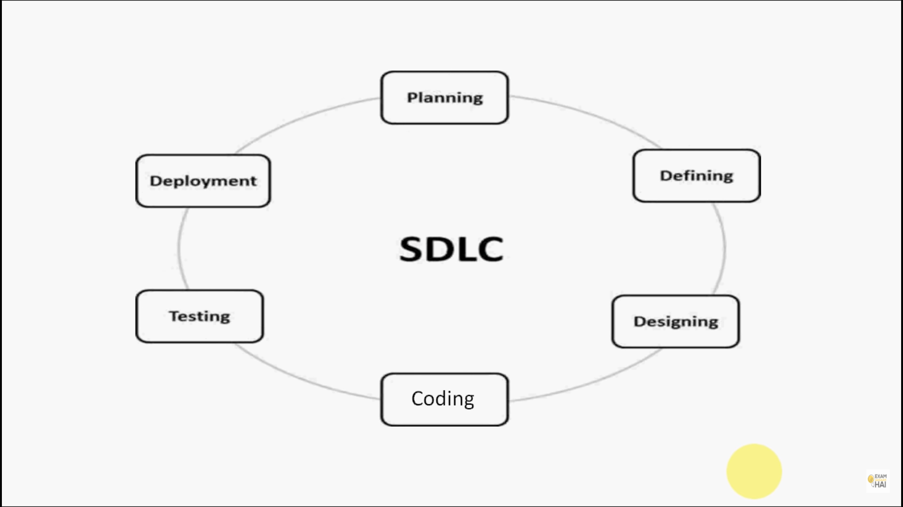
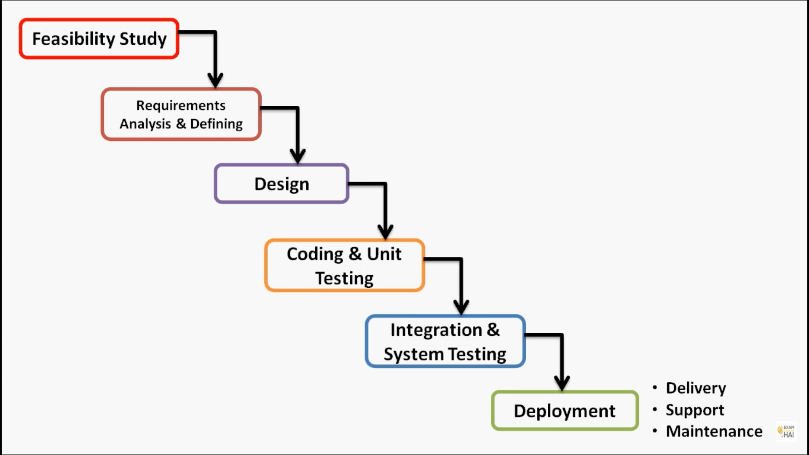

# Software Engineering

## Table of Contents

-   [**Software Engineering**](#software_engineering)

    -   [**Table of Contents**](#table-of-contents)

        -   [Introduction](#introduction)
        -   [Software is Developed not Manufactured](#software-is-developed-not-Manufactured)
        -   [Software Development Life Cycle](#software-development-life-cycle)
        -   [Waterfall Model](#waterfall-model)
        -   [Classes](#classes)
        -   [SOLID](#solid)
        -   [Testing](#testing)
        -   [Concurrency](#concurrency)
        -   [Error Handling](#error-handling)
        -   [Formatting](#formatting)
        -   [Comments](#comments)

### `Introduction`

Software engineering is the application of engineering to the development of software in a systematic method.

Why Software engineering?

1. As Software development is expensive so proper measures are required so that the resources are used efficiently and effectively.

2. Cost and time considerations are another factor, which arises the need for Software Engineering.

3. Reliability factors.

Main Principal: The Vision must be clear.

**[⬆ back to top](#table-of-contents)**

### `Software is Developed not Manufactured`

Why Software is Developed or Engineered, not Manufactured?

Answer:
Saying that something is manufactured means that it is created, 'from the ground up', from nothing. And that certain chemical/physical processes are used to create it.

Software has NO physical form. It is computer code, instructions for an operating system (something else without physical form). A computer program is kind of like a story, something else without physical form. Although it is easy to memorize a short story, it is darn near impossible to memorize computer code. People who write computer programs use nothing of a physical process to create the software. They simply use words/letters to create the code. The finished code is called 'software'. Sometimes the software is an operating system, a program, a widget, or simply 'code'.

**[⬆ back to top](#table-of-contents)**

### `Software Development Life Cycle`

Software Development Life Cycle (SDLC) is a process used by the software industry to design, develop and test high quality software. The SDLC aims to produce a high-quality software that meets customer expectations, reaches completion within times and cost estimates.

1. Planning and Requirement Analysis.
2. Defining Requirements
    - SRS
3. Designing the Product Architecture
    - meta-data and data dictionaries,
    - logical diagrams,
    - data-flow diagrams
4. Building or Developing the Product
    - Coding
5. Testing the Product
6. Deployment in the Market and Maintenance.

SDLC Models
There are various software development life cycle models defined and designed which are followed during the software development process.

    - Waterfall Model
    - Iterative Model
    - Spiral Model
    - V-Model
    - Big Bang Model

**[⬆ back to top](#table-of-contents)**

### `Waterfall Model`

Waterfall Model:

1. The Waterfall model is the earliest SDLC approach that was used for software development.

2. Waterfall model is an example of a Sequential model. So it is also referred to as a linear-sequential life cycle model.

3. It is very simple to understand and use. In a waterfall model, each phase must be completed before the next phase can begin.

4. Also called as classic life cycle model.

When Should You Use It?
Ans:

1. Requirements are clear and fixed that may not change.

2. There are no ambiguous requirements.(no confusion)

3. It is good to use this model when the technology is well understood.

4. The project is short and cost is low.

5. Risk is zero or minimum.

Advantages:

1. Simple and easy to understand and use.
2. Easy to manage.
3. Works well for smaller and low budget projects where
   requirements are very well understood.
4. Clearly defined stages and Well understood.
5. Easy to arrange tasks.
6. Process and results are well documented.

Disadvantages:

1. No working software is produced until late during the life cycle.
2. High amounts of risk and uncertainty.
3. Not a good model for complex and object-oriented projects.
4. Poor model for long and ongoing projects.
5. It is difficult to measure progress within stages.
6. Cannot accommodate changing requirements.
